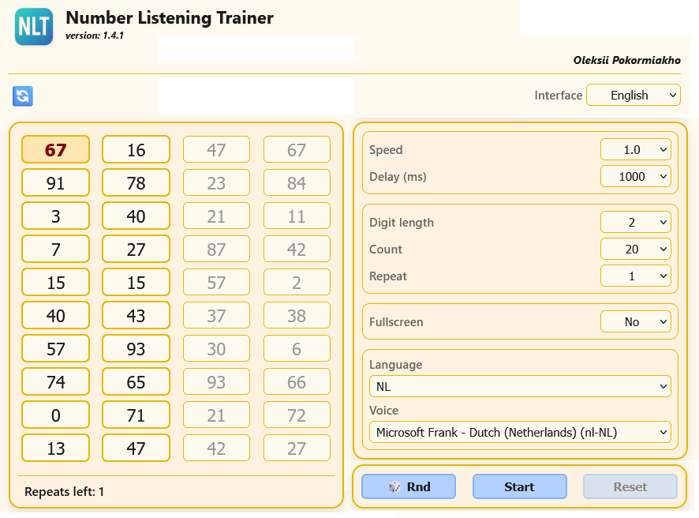

# NLT Number Listening Trainer
This is a small one-page application for learning numbers in foreign languages. 
The application used the method of simultaneous auditory and visual perception for quick memorization.

