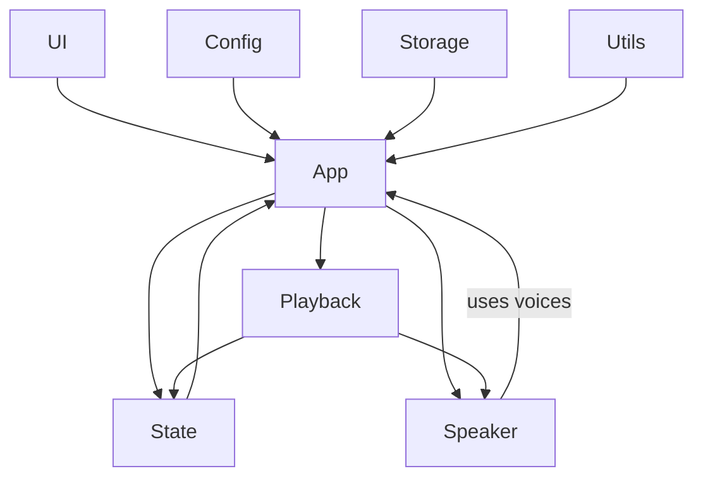

# Project Structure and Dependencies

## Dependency Diagram

## Modules
- **State**: centralized store with pub/sub.
- **UI**: DOM elements, events, updates.
- **Speaker**: wrapper for speechSynthesis.
- **Playback**: business logic of playing text.
- **Config**: default settings, config loading.
- **Storage**: localStorage integration.
- **Utils**: helper functions.
- **App**: root controller wiring modules.
